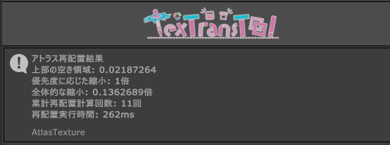
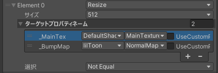
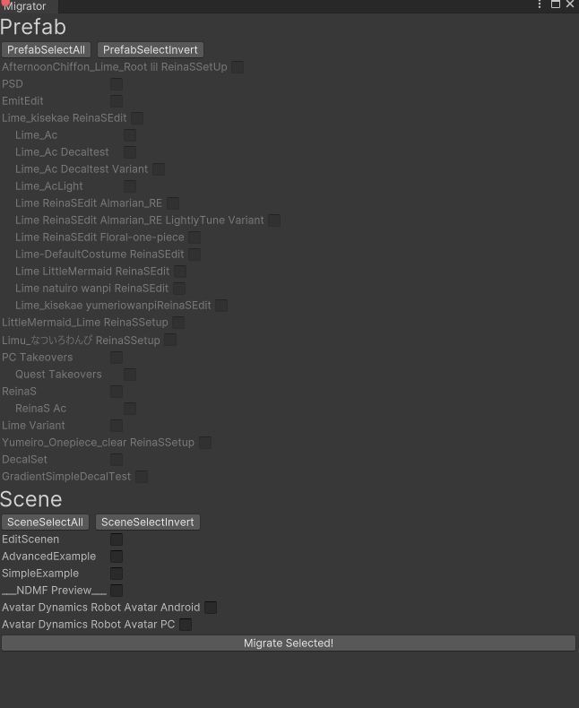

どーも！ Reina_Sakiria です！

今回適当に v0.8.0 にやったことを自分自身も忘れてしまうこともあるので見返せるようにとか、純粋に面白いからこのようなものを書いてみることにしました！

結構 TTT に詳しい人しかわからないような内容になっているかもしれません...許してね！

v0.8.0 にて行われた変更点すべてはこの、

- [CHANGELOG.md](https://github.com/ReinaS-64892/TexTransTool/blob/500e711ba10124b48f004124283200002564f2eb/CHANGELOG.md?plain=1#L10-L71)
- [CHANGELOG-EXPERIMENTAL.md](https://github.com/ReinaS-64892/TexTransTool/blob/500e711ba10124b48f004124283200002564f2eb/CHANGELOG-EXPERIMENTAL.md?plain=1#L9-L50)

変更記録にすべてがあります。

このブログではそれを適当に意図とか書きつつその内容を書いていくね！

ちなみ...結構思想とか適当に書いてるのでやばいこと言ってても許してね...

## NDMF

> - NDMF-Preview に対応 (#516)

v0.8.0 の目玉の一つ！ NDMF-Preview への対応！

アバターに D&D した瞬間からプレビューが動作するなどの、非常に強力で今後のテクスチャ非破壊改変のしやすさが大幅に上がるね！とってもうれしい！
異種混合同時プレビューも可能で [Modular Avatar](https://modular-avatar.nadena.dev/ja) とも同時にプレビューできるようになるんだ！

少し先かもだけど、[AAO: Avatar Optimizer](https://vpm.anatawa12.com/avatar-optimizer/ja/) とも同時にプレビューできるようになるだろうから絶対 [MA] v1.10.0 にアップデートしようね！
そうすれば [NDMF] v1.5.0 も同時にインストールされるから！

---

> - NDMF-Preview の場合が テクスチャースタックをマージした時 Texture2D へのコンバートを行わないようにし高速化 (#526)

これは上記 NDMF-Preview の場合内部的に RenderTexture のままにしておけばプレビューが軽くなるってだけの話だね！

Texture2D へのコンバートって遅いからね...

---

> - NDMF v1.5.0 以上がプロジェクトに存在する場合 Preview、RealTimePreview のボタンは NDMF-Preview の フェーズ単位で有効化、無効化のボタンになるようになりました (#593)

これは、既存のプレビューを行っていたボタンを [NDMF] のプレビュー単位レベルで制御できるものに置き換えたんだ！

別に置き換えないこともできるけど、既存のプレビューと [NDMF] プレビューが混じってしまうと混乱を生むし、わかりずらいからね！

---

> - NDMF の v1.3.0 以降で NDMF 要求バージョンを満たしていない場合に NDMF Console に警告を表示するようになりました (#643)
> - NDMF の v1.3.0 以降で NDMF 要求バージョンを満たしていない場合に NDMF Console に表示される警告にデスクリプションを表示するようになりました (#644)

[NDMF] が必要なバージョンを下回っている場合に NDMF-report を用いて アバタービルド時に警告を発生させるだけの話だね！

---

> - ~~NDMF の対応バージョンが v1.3.0 以上に変更 (#516)~~
> - NDMF の対応バージョンが v1.5.0 以上に変更 (#593)

NDMF-Preview への対応の際に旧バージョンとの互換性を持つのが面倒くさくなったからドロップしました！

以前は [NDMF] v1.0.0 から最新までのサポートをしていたのですが...まぁ [MA] とか [AAO] も同時にみんなアップデートするだろうし、そこまでして古いバージョンへのサポートを維持する必要もないかなって思って、切り捨てることにしました！

---

> - 一部のコンポーネントの子となり取り扱われるコンポーネントが NDMF-Preview で追加や削除が正しく反応しない問題を修正 (#569)

ただのバグ修正やね...特にいうことなし！

まぁリリースされるバージョンでは MultiLayerImageCanvas が正しくプレビューできるってだけの話！

---

> - NDMF v1.4.1 などの NDMF 非対応バージョンがプロジェクトが存在する場合に警告が発生しない問題を修正 (#619)

ちょっと上で、サポートバージョンの切り上げが発生したから、警告を正しく出さないといけないよね！

## AtlasTexture

> - AtlasTexture の アイランド再配置結果の詳細を NDMFConsole にレポートする機能を追加 (#531)

結局 アトラス化した結果、縮小が発生したのか...とかいろいろ、私は目視で適当に見て見当をつけれるけどそれも完ぺきではない

だから、アトラス化した結果がどうなるかっていう情報を出すのには価値があるんだ！

`上部の空き領域` はどれくらい満杯に詰まってるかがわかる値で 0 に近ければ満杯、 1 に近ければまだ余裕があるってこと！

`優先度に応じた縮小` 0倍が 優先度に応じた縮小が完全に行われた、 1倍が優先度に応じた縮小が 行えなかった OR 必要なかった ってことだね！

`全体的な縮小` 1倍 が縮小されていない、値が小さくなるにつれて、まとめる量が多く面積が溢れて解像度が足りなくなっていると考えていいね！

`累計再配置計算回数` `再配置実行時間` これはそんな意味なくて、どれくらいの回数計算したかとかかった時間ってだけ。

これ後で ドキュメントの方にいい感じに書かないといけない気がするわね

---

> - AtlasTexture TextureFineTuning ReferenceCopy の TargetPropertyName がリストに変更されコピー対象を複数指定可能になりました (#532)

リファレンスコピー が複数のプロパティ に対して行えるようになったよ！やったね！

以前は一つずつしか指定できなかったからね！

---

> - AtlasTexture の _MainTex 以外のプロパティで アトラス化対象だった場合、アトラス化後のサイズが自動的にそのプロパティのテクスチャの最大サイズが割り当てられるようになりました (#550)

これは、今まで メインテクスチャー以外もすべて アトラス化後のサイズが アトラステクスチャーサイズと同じになるんだけど、それをそのままにすると VRAM の増加を招くんだ...それを抑えるために、
最初から AtlasTexture には メインテクスチャー以外を 512 にリサイズする 詳細設定が付与されているんだ。

でも、もうちょっと正しく設定できると思って、そのプロパティで使用される最大値が割り当てられるようにしたんだ！

一応今後もデフォルト設定のリサイズは消えないけど、ちゃんと VRAM の変動量を見る前提でそのリサイズを消してみてね！

---

> - AtlasTexture で生成されるテクスチャーの MipMap 生成が Unity標準ではなく、アルファを加味したもを使用するようになりました (#558)

これね！ TTT では Unity 標準の MipMap 生成はランタイム向けっぽくて品質があんまり良くないから Compute shader で独自実装したの！

これによって 透過を使用したテクスチャとかのミップマップに変な色が混じるのを抑えたりできるんだ！

---

> - AtlasTexture に BackGroundColor が追加され、初期設定で白色に背景色が設定されるようになります (#558)

この背景色設定は、MipMap だったり、テクスチャのVRAM上での圧縮の時などに影響するんだ...

MipMap の話は上の MipMap生成がアルファを加味するようになったから透明色にすると関係のない色が混じるのを抑えらりできるって話なんだけど...圧縮の方は下の方に書いてると思うからそっち読んでね！

---

> - AtlasTexture TextureFineTuning MipMapRemove に MipMap を削除しないように上書きすることを可能にするための IsRemove プロパティを追加 (#561)
> - AtlasTexture TextureFineTuning Remove に 削除しない等に上書きすることを可能にするために IsRemove プロパティを追加 (#613)

これは、削除する範囲から、削除しない一部を定義できるようにしたかったってだけの話だね！
以前は、削除する定義を覆す方法がなかったから...

---

> - AtlasTexture の選択候補の表示が、マテリアルのグループ化された状態で表示されるようになりました (#564)

そもそも マテリアルは AtlasTexture 内部で グループ化して扱われるんだ...(だいたい v0.7.0 ごろからそうなってる)

例えば髪の毛のマテリアルと、髪の毛の透過マテリアルなどが良くグループ化されるんだけど、
こういうやつらを同一として扱わないと...エッジケースだけど、余分なテクスチャの領域を使用してしまい、無駄が発生するんだ。

だから、テクスチャが衝突しないものは同一として扱って、違うマテリアルでも同じアイランドが割り当てられることがあるんだけど...その場合 大きさの優先度がの値が複数になっちゃうんだ

その場合 AtlasTexture は平均をとって`大きさの優先度`を定めるのだけど、そのあたりどこが同一(グループ)として扱われてるかわかるようにしないと不便だよねってことで表示されるようになったよ！

---

> - AtlasTexture の PixelNormalize 実験的機能から外れました！ (#585)

以前へ実験的機能だったけど、これが無いと著しく解像度が落ちてしまう衣装が見られたから、超雑な実装を書き直して正しくしてデフォルトで有効化にしました！

以前のバージョンから使っている人は無効化されたままだけど、有効化してみてね！

---

> - AtlasTexture のアイランド再配置に失敗した場合にエラーログを出力するようになりました (#586)

さすがに、何も言わず壊れた状態にするのは良くないねって思って...

---

> - ~~AtlasTexture の NFDHPlasFC が外側のパディングを消去し再配置効率が上がりました (#588)~~
> - AtlasTexture の NFDHPlasFC が外側のパディングが半分になり、再配置効率が上がりました (#640 #648)

外周に余白が見えているとさすがに無駄だからそれを消しました！
ちょっと消しすぎちゃって問題が出たからちょっと巻き戻しが入ったけどね！

---

> - AtlasTexture が レンダラーのマテリアルに Null が含まれている場合でもアトラス化の対象にできるようになりました (#612)

この仕様って...古い TTT の頃の使用をただただ引きずっていただけなのよね...だから消しました！

これからは一部に Null が含まれていても、該当部分がアトラス化されないだけで問題なくアトラス化できるよ！

---

> - AtlasTexture の影響範囲が TargetRoot に影響されなくなり、インスペクターのマテリアル表示制限の機能のみに変更 (#516)

これ結構内部的には大幅な変更だし、以前の状態を再現することはできいのよね...

でもこの変更をしないと アバターの外 に AtlasTexture を設定して放置してしまうケースを排除しずらいから必要だったし...

なにより、これによって 設定済み AtlasTexture を D&D で導入することで軽量化させる動作が可能になるんだ！

あと、最初の無駄な手順の排除ができるからとてもいい感じ！

---

> - AtlasTexture TextureFineTuning の PropertyNames でスペース区切りの複数指定が行える仕様は削除され、リストに変更されました (#532)

この... CustomPropertyName を有効にして スペース区切りでプロパティ名を入れることで複数指定するとかいう...ありえんわかりずらい隠し仕様みたいなやつを削除しました。

今後は代わりにリストで複数指定できます。　やったね！

---

> - AtlasTexture TextureFineTuning Compress のフォーマットクオリティで決定されるフォーマットがアルファの使用有無を加味したものになるようになりました (#558)

背景色設定が追加された所以でもあるんだけど...以前はアルファとか全く加味せずにフォーマットを決めていたところを、加味するようになりました。

具体的には 以前 Low Normal High が適当に `DXT1/BC1` `DXT5/BC3` `BC7` に決め打ちされていたのが、アルファの有無で Low Normal がそれぞれ `DXT1/BC1` と `DXT5/BC3` 分岐するようになりました。

これによって背景色が透明なままだと透明な場所が一切なくても、 `DXT1/BC1` にならなくなってしまうから、背景色を完全に透明じゃない色にする必要があり...
でもそうしてしまうと MipMapに関係ない色が混じってしまうから、そのあたりをユーザーに制御させるべきなので、 背景色設定と実験的詳細設定機能として `Discard Alpha` が追加されています。

---

> - AtlasTexture TextureFineTuning Compress を新しく生成した時の値を変更しました (#561)

その部分の値が初期化値が決められておらず、ひどい状態だったので決めてデフォルト値を扱いやすい物にしたよ！

---

> - lilToon の \[Optional\] 系を誤って 通常のlilToonの対応で認識してしまい、例外が発生する問題を修正 (#520)
> - lilToon の宝石シェーダーが誤って 通常の lilToon としてサポートされていた問題を修正 (#598)

誤った対象をデフォルトの lilToon と認識してしまうと...例外の原因だからね！

---

> - SubMesh よりも多くの MaterialSlot がある場合 AtlasTexture のメッシュノーマライズで、誤ったサブメッシュで複製される問題を修正 (#521)

これ...マジで Unity の サブメッシュの数より多いマテリアルの使用を私が理解していなかったがゆえに起きたバグ...

一番最後のサブメッシュがずっと伸ばされるような感じみたいだね。

---

> - AtlasTexture の IslandFineTuning が Null な場合や IslandSelector が Null の場合に例外が発生する問題を修正 (#530)

ただのハンドリング忘れ。

---

> - AtlasTexture の TextureFineTuning Resize が AtlasTextureSize よりも大きい解像度に変更できていた問題を修正 (#550)

高い解像度が欲しいなら、アトラステクスチャーサイズから上げてください。

---

> - AtlasTexture でアトラス化されたテクスチャが他UVを参照していたり無効だった場合に割り当てないようになりました (#565)

これによってちょっとトリッキーなことができるようになったのよね！

例えば lilToon の NormalMap2nd は別UVを指定できるから UV1 を指定して、AtlasTexture の WriteOriginalUV を UV1 に向ければ、アトラス化から除外した状態にしてそのまま使うことができるのよね！

---

> - AtlasTexture の アイランド再配置 NFDHPlasFC が 上の列から見た空き空間の計算を誤った値にしてしまいアイランドが重なって見た目が変わってしまう問題を修正 (#591)

マジでエッジケースだったんだけど...このあたりの計算が以前から間違っていたらしい

怖すぎ！！！

---

> - AtlasTexture の lilToon _MainTexHSVG のベイクが正しく行われない問題を修正 (#611)
> - AtlasTexture lilToonSupport の TextureBake で MatCap が使用されていない場合 MatCapBlendMask が白色になってしまう問題を修正 (#634)
> - AtlasTexture lilToonSupport の _Main3rdTex の使用可否判定が誤っていた問題を修正 (#634)

シェーダーサポートはつらいよ...私 lilToon しか使ってないからほかシェーダーが使いたいなら自分で対応を書いてね！

ちょっと前からスクリプタブルオブジェクトでできるから...まぁそのあたりまだまだ不安定だけどね

---

> - AtlasTexture の TextureFineTuning Compress が ReferenceCopy などが行われた場合に誤った形式で圧縮される問題を修正 (#654)

圧縮が即時実行されないがゆえに、同じテクスチャに複数、"この形式に圧縮して！" ていう命令を発生させてしまったがゆえに、ハッシュの順番だから(恐らく)名前順的に一番最後の命令が優先され、誤った形式で圧縮されることがありました。

このバグ...恐らく結構前から存在してると思われる...怖いね.......

調べところ... v0.5.0 のころからっぽいね....

私が見つけたわけではなく、[報告](https://github.com/ReinaS-64892/TexTransTool/issues/653)によって発見されたものなのだけど...こういうことがあるから人からの報告って重要なのよね...

まじで...ご報告に感謝！

## そのた

> - 部分的マイグレーションが可能なウィンドウ追加と、ツールバーとマイグレーション通知から開けるようになりました (#620)

TexTransTool が、今後ももう少し破壊的変更を繰り返すことに対する覚悟でもある... v1.0.0 はいつになるんだろうね！

それはそうとして...部分的にマイグレーションを走らせるための特別なウィンドウが追加されました！

画像はマイグレーション済みだからちょっとグレーアウトしてるけど、プレハブバリアントの階層ごとに少しネストされたような表示になってたりもします。

この時、できるだけまとめてやることを推奨します...特にバリアントなどは根元から一気にやることを推奨します。

あと、 __絶対にバックアップするようにね！！！__ どうなってもこの TexTransTool は MIT license で __無保証__ なツールだからね！！！

まぁ..このツールを使う人はある程度上級者でありトラブルシューティングなどができると思って開発しまいますが...まぁそうでなかったとしたら 私を含む強い人に聞いたりしながら頑張りましょう！

---

> - v0.9.0 にて廃止される予定のコンポーネントの入れ子状態に警告を発生させるようになりました (#629)

次のマイナーでは SimpleDecal を MultiLayerImageCanvas のレイヤーとして扱うみたいなことを考えているので(検討している)

かなりの挙動変更なので事前に警告を発生させることにしました。

---

> - 実行できない場合などの information などが以前よりも細かく出力されるようになりました (#630)

何も言わずに、何もしない状態になるよりかは...多少何か言って、何もしない状態になったほうがいいかなって思って！

---

> - SimpleDecal のスケールが反転しているときにヘルプボックスを表示するようになりました (#631)

SimpleDecal はスケール反転などが起きると SideCulling が表向きの方をカリングしちゃったりするから、それを明示するための存在が必要だった。

---

> - 二のべき乗の値を想定する入力欄がポップアップに変更 (#516)

以前から二のべき乗の値をせってすべき場所は適当な値を入れた場合、二のべき乗に補正されていたんだけど...あんまりこの仕様は知られていないっぽいからポップアップでの選択式に置き換えました。

だけど以前のほうが好きな人もいるかもしれんし...8196とかの入力ができなくなったから、以前の状態に戻せる設定とかを作ろうかなとも考えている。

---

> - SerializeReference を使用している部分のUIが、[Unity-SerializeReferenceExtensions](https://github.com/mackysoft/Unity-SerializeReferenceExtensions) を使用したものに変更 (#519)

以前は独自に書いてたんだけど、ありえないほどめんどくさかったから優秀な奴を引っ張ってくることにした！

ありがとう！ Makihiro さん！

---

> - ReferenceResolver は削除されました (#517)

D&D で使えるようにしたかったから追加された存在だったけど...プレビューができなかったり、私が忘れるレベルで使用されていなかったものなので消しました。

何なら今後は デフォルトでコンポーネントが D&D で動くように設計を変えていく方針だから、もういらないね！

---

> - SimpleDecal でリアルタイムプレビュー中に IslandSelector を割り当てた時に IslandSelector の調整でプレビューが更新されない問題を修正 (#525)
> - プレイモードに入るときなどのビルド時にコンポーネントが新しく生成したが、最終的に使用されていないテクスチャが Null となりテクスチャ圧縮のタイミングで例外が発生する問題を修正 (#581)
> - SimpleDecal の適用対象のレンダラーのマテリアルに Null が含まれている場合に例外が発生する問題を修正 (#612)
> - UnsafeNativeArrayUtility の不要な using で Android ビルドにてコンパイルエラーが発生する問題を修正 (#641)
> - 圧縮設定を None などの圧縮しない形式にした場合に誤って MipMap が Unity標準の物で再生成されることがあった問題を修正 (#649)

ただのバグ修正やね！いうことなし。

---

> - GameObject/TexTransTool から生成した GameObject がレコードされて終らず、元に戻すを行っても消えない問題を修正 (#602)

右クリックから生成したのを巻き戻しできない問題がったのだけど Ao_425 さん が直してくれました！ありがと！

---

> - マイグレーションの時に、拡張子が `.Unity` となっているシーンが存在するとマイグレーションに必ず失敗する問題を修正 (#620)

これ私悪くないと思うんだけど...

---

> - マイグレーション終了時のシーン復元処理で、すべてのシーンがロード状態で復元されてしまう問題を修正 (#657)

私が基本的にひとつのシーンにプレハブを消したり置いたりしてる運用で、シーンを複数ロードするやり方をしていないから全く知らなかった...

Thanks Gomorroth!

## 実験的機能

> - AtlasTexture に TextureFineTuning を個別に行う TextureIndividualFineTuning が追加 (#532)
> - TextureIndividualFineTuning の調整用ウィンドウ TextureFineTuningManager が追加 (#532)

以前までのやつはまとめての調整に適しているけど、それだとやりずらい場合があるから...個別調整用の仕組みを追加しました！

この個別調整用ウィンドウで行える TextureIndividualFineTuning のほうが TextureFineTuning よりも強い(後に適用)ので、そのプロパティのテクスチャのサイズとかを適当に書き換えたりとかできるんだ！

あと、どんな感じのサイズになるか...とかの情報もプレビューできるから便利だね！

ただ...個別調整用ウィンドウを閉じずに AtlasTexture の方の編集はしないようにね...そのあたり変更は全く監視してないから。

何とかしたいものだけども...

---

> - SingleGradationDecal に SimpleDecal と同じ詳細設定が追加されました (#539)

私が実装をただただ放置してたやつだね...ありがと！ Gomorroth！

---

> - AtlasTexture WriteOriginalUV の書き込むチャンネルを指定できる OriginalUVWriteTargetChannel が追加されました (#540)

以前は UV1 にしか書き込めなかったのを、別のチャンネルに書き込めるようにしたよ！やったね！

これでまた、何かトリッキーなことに使えるかも...?

---

> - 簡易的なグラデーションマップとして UnityGradationMapLayer が追加されました (#545)

改変用のレイヤーですね！

なぜ名前が Unity なのかっていうと、 Unity標準のグラデーションを使用しているから。

つまりこれは既存のペイントソフトの再現ではないから...いずれグラデーションマップレイヤーは増えます。

---

> - テクスチャの使用率をざっくりと調べることができる DomainTextureAnalyzer が追加されました (#546)

私は、適当にUVを見て、使用されてない個所などを感覚で見当つけたりできるけど...これは特殊技能に近いので、それを簡易的にざっくり行える機能ですね！

アバタールートを選択した状態で `Tools/TexTransTool/DomainTextureAnalyzer` を使用すると表示されるよ！

この時テクスチャの使用率やどこが使用されているかがさっくりと表示されるけど、これはアニメーションによる制御は全く加味してないから気を付けてね！

ちなみに、使用率が赤色だったら、ほぼ確実に AtlasTexture によって無駄が削減できるって考えていいよ！
黄色は微妙、白は逆に無駄が増えるから、ちゃんとどうなるか見ながら AtlasTexture を設定してね！

---

> - AtlasTexture に同じテクスチャが割り当てれる場合に ReferenceCopy を自動で設定する AutoReferenceCopySetting が追加されました (#550)
> - AtlasTexture にテクスチャが衝突しない場合に MergeTexture を自動で設定する AutoMergeTextureSetting が追加されました (#555)

アウトラインカラーなどのほとんどのケースで同じテクスチャが使用されている場合に、自動でリファレンスコピーを設定してくれる実験的機能。

あと...衝突しない場合に MergeTexture を自動設定できる実験的機能も追加されました！衝突するか否かは機械的に見たほうがわかりやすいからね！

正直手動でやった方がリファレンスコピーはいい場合があるから...個別調整用ウィンドウから結果を見ながら使ってみてね！

ちなみに...マテリアルマージをする場合はあんまり動作しない(または完全に動作しない)場合があるから気を付けてね！

---

> - AtlasTexture TextureFineTuning に別のプロパティとテクスチャを適当に統合する MergeTexture が追加されました (#555)

マージマテリアルをしないなら、別のプロパティのテクスチャとくっつけちゃえば、衝突しない場合問題がないからね！

マテリアルを横軸として、プロパティが縦に並んでるとしたら、縦軸でのテクスチャのマージになるわけだけど...結構めんどくさいから自動設定を個別調整用ウィンドウで見ながら補正する形でやるのを推奨します。

---

> - AtlasTexture に DownScalingAlgorism が表示されるようになりました (#558)

表示されるだけっすね...いずれ意味を持つでしょう。

---

> - AtlasTexture TextureFineTuning にアルファチャンネルを最大値に塗りつぶし、アルファの情報を破棄する DiscardAlphaChannel が追加されました (#561)

MipMapには背景色がにじんでほしくないが、圧縮の時は不透明なテクスチャとして扱ってほしい場合に使用するものですね！

うまく使ってください１

---

> - TextureConfigurator にダウンスケール時にアルファを加味してサイズを縮小するかどうかのオプション DownScalingWithLookAtAlpha が追加されました (#573)

ノーマルマップの場合はアルファを加味してしまうとちょっと変になってしまう(二軸の情報の片方がアルファに入ってるから)ので、それ用ですね。

ノーマルマップを調整する場合はこれを外してくださいな！

---

> - 縦方向固定でグラデーションをそのままキャンバスに描画するレイヤー YAsixFixedGradientLayer が追加されました (#577)

これは、いずれ自由なグラデーションを実現できる存在にすることでしょう。

グラデーションレイヤーと対応するものとして...

でもこれの場合、 UnityGradientLayer になるべきじゃん！！！まぁそん時になったらグラデーションが違うグラデーションレイヤーが追加されると思う。

---

> - SimpleDecal に キャンバスの内容をそのままデカールにできる OverrideDecalTextureWithMultiLayerImageCanvas が追加されました (#579)

やばやば機能すぎる...でも PSD から持ってきた MLIC をそのままデカールとして使いたいときもあるよね...

でもこれ...参照じゃなくて、デカールの子のオブジェクトだった場合に変更するかもしれんね。

---

> - AtlasTargetDefine に MipMap の生成時などに使用される IsNormalMap が追加されました (#589)

定義しないといけなかったのよね... TextureConfigurator に追加された DownScalingWithLookAtAlpha と同じ意味を持ちます。

---

> - Gimp の着色と同じ効果を持つ ColorizeLayer が追加されました (#601)

要望を出したと人にいい感じに作ってもらいました！ ありがとね  Ao_425 さん！

---

> - AtlasTexture に アトラス化後のマテリアルに対して スケール(タイリング)とオフセットをリセットする TextureScaleOffsetReset が追加されました (#636)
> - AtlasTexture に アトラス化後のマテリアルに対して ベイクされたプロパティに最大値を割り当てる BakedPropertyWriteMaxValue が追加されました (#636)

_ST を使っているようなループテクスチャとかの類がアトラス化対象になった場合に、適用されてはいるがマテリアルの値がリセットされていないがために結局壊れる問題を何とかするための存在。

アウトラインとか、ベイクする場合最大値を割り当てないと正しく維持できないのだけど...それをするのめんどくさいので、それをどうにかする存在。

ちなみに...0~1のfloatのプロパティを焼きこむ場合に以前はアウトラインだけだったのが、ほとんどの物が最大値を書き込むようになったよ！

少しだけ値の劣化が減ったかもしれないね！

---

> - AtlasTexture に アトラス化後のマテリアルに対して 特定のテクスチャに対して割り当てを行わないようにできる UnsetTextures が追加されました (#637)

TTT はユーザーの意思であれば破壊は無限にして良い思想なので、ループテクスチャの類を元のテクスチャのままにしておくようなことをするための存在ですね！

見た目はちょっと変わるかもしれないけど、まぁこれを設定するということはそれを理解していると私は思っています。

---

> - SolidColorLayer Color の Alpha を無効化 (#544)

同じ意味を持つものが複数存在すると時に混乱することもあります。

Color が持つアルファと Opacity が完全に同じ意味でしかないので Color の側を消しました。

---

> - TextureConfigurator の圧縮設定のオーバーライドでフォーマットクオリティで決定されるフォーマットがアルファの使用有無を加味したものになるようになりました (#558)
> - TextureConfigurator の初期設定を変更 (#562)

AtlasTexture の TextureFineTuning Compress の内容に引きずられています。

内部的には同じものを用いているので当然の話。

---

> - AtlasShaderSupportScriptableObject AtlasTargetDefine の BakePropertyNames は BakePropertyDescriptions に変更され、UseMaxValue が有効ではない場合 BakeShader に Bake時に最大値が割り当てられなくなりました (#636)

AtlasShaderSupportScriptableObject のセーブデータ破壊案件、軽くマイグレーションを仕込みましたが初回は破壊されるので InternalDebug を用いて値を減らすことでマイグレーションを呼び出せます...頑張ってね！

それはそうとして MaxValue をベイク時に必要とするなら適切にチェックを入れてね。

ちなみに Color の物に対して行った場合の挙動は未保証です。 Float のやつだけにしてほしいかも～

いや何とかしろ案件でもある...

---

> - SingleGradationDecal でリアルタイムプレビュー中に IslandSelector を割り当てた時に IslandSelector の調整でプレビューが更新されない問題を修正 (#525)
> - LayerFolder に 空の GameObject が含まれると、実行時に例外が発生する問題を修正 (#538)
> - TextureBlender TextureSelector が Absolute の場合、SelectTexture を割り当てても実行できない問題を修正 (#560)
> - AtlasTexture TextureFineTuning MergeTexture で MergeParent を存在しないものに指定した場合に例外が発生する問題を修正 (#561)
> - SingleGradientDecal の適用対象のレンダラーのマテリアルに Null が含まれている場合に例外が発生する問題を修正 (#612)
> - AtlasTexture MaterialMergeGroup の MergeReferenceMaterial が Null の場合例外が発生する問題を修正 (#636)
> - IslandSelectorOR などの子のコンポーネントを使用する IslandSelector が、子のコンポーネントの削除や増加を監視し忘れていた問題を修正 (#659)
> - TextureBlender BlendTexture が空の状態で実行できない問題を修正 (#665)
> - TextureBlender などの TextureSelector が AbsoluteMode だった場合、レンダラー Null 例外や存在しないプロパティへのアクセスが発生していた問題を修正 (#665)

ただのバグ修正っすね...いうことなし！

---

> - TextureConfigurator で OverrideCompression は有効だが、OverrideTextureSetting が無効な場合に解像度や MipMap の有無が正しくないテクスチャが生成される問題を修正 (#573)
> - TextureConfigurator でもともとのテクスチャよりも大きい解像度を指定した場合に MipMap の0番あたりが黒くなってしまう問題を修正 (#580)

だれですか？？？こんな簡単に踏めるバグ作ったやつ？？？

まぁ私しかいないんだけどさ....

---

> - TexTransToolPSDImporter がインポートするレイヤーのプレビューTexture2D の圧縮形式が誤って DXT5 になっていた問題を修正 (#604)

`DXT5/BC3` って...互換性を無視するなら `BC7` のほぼ完全な劣化でしかなく...プレビューにわざわざ `DXT5/BC3` を使うの自体が間違っていたのだ。

---

> - TTT PSD Importer 一部の PSD で ImageResourceBlock に Name が含まれている物の読み取りに失敗する問題を修正 (#632)
> - TTT PSD Importer 一部の PSD で 重複した色チャンネルを持つと主張する PSD の読み取りに失敗する問題を回避 (#638)

PSD のエッジケースを踏み抜きました！やったー！

まぁ...うん...あはは...PSDは共通規格じゃないんだよ。
それを見れば何とかなる仕様書なんてものはない。

## ちょっとした感想と次やること

今回のアップデートは NDMF-Preview と AtlasTexture の追加使い勝手の改善はメインです。

AtlasTexture とかは虚無すぎる手順が消えたりしてとてもいい感じだし、それのおかげで D&D で適用するみたいなことができてとてもいい感じで良きなのです！
あと、 NDMF-Preview はめっちゃ便利だからぜひ使ってみてね！

今後の事なんだけど... v0.9.0 は TTT の色改変系に注力する予定だよ！

高い可能性で SimpleDecal に大きな破壊的変更が入るだろうから...気を付けてね！

他にも Island の x軸分割とか結合とか、いろいろトリッキーなことをできるようにしたい。

詳細は レポジトリの Milestone にあるから見てみてね！

あと今後、TexTransTool は Unity ライブラリから、 C# のライブラリになろうとする計画が v0.9.0 から動き始めるから...いずれは Unity 以外の場所でも TTT の資産を持ち込めるのがとっても楽しみなんだ！

まぁこれは UnityEditor 上から使う場合は表面上はたいして変わらない話なんだけどね！

まぁ...そんなわけで、今後もしばらくは破壊的変更をしていくと思うけど今後も TexTransTool をよろしくね！

[MA]:https://modular-avatar.nadena.dev/ja
[NDMF]:https://github.com/bdunderscore/ndmf
[AAO]:https://vpm.anatawa12.com/avatar-optimizer/ja/
