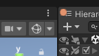
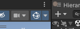
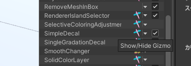
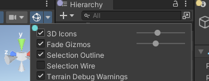
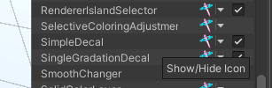

# FAQ

## アップロードしたアバターに効果が反映されないまたは壊れる

主にプレビューでは正常に動作するが、VRChatにアップロードしたアバターにはプレビューのような結果にならない状態。

この場合 Material置き換えアニメーションが存在しないか確認してください！
TexTransTool はマテリアル置き換え等のアニメーション系の影響を一切考慮しません！

- SimpleDecal などのデカール系やテクスチャ編集系は マテリアル置き換えによってもともともマテリアルに戻されてしまい、それに伴いすべて元のテクスチャになります。
- AtlasTexture は UV の変更及びメッシュの置き換えは残ったまま、マテリアルだけもともとの物に戻されてしまい、UVの参照位置の違いによりテクスチャ等が破綻した状態になります。

これらの解決策はマテリアルアニメーションを行わないことで可能なので削除してください！

## アップロード時やEditorの再生時、マニュアルベイク時に適用されない

[チュートリアル](/docs/Tutorial#アップロードの時の注意点)に書かれている内容もご参照ください！

そして、プロジェクトに TexTransTool が対応している [NDMF](https://github.com/bdunderscore/ndmf) が導入されているかもご確認ください！

特に、 TexTransTool のプレリリース版を使用している場合、[NDMF](https://github.com/bdunderscore/ndmf) もプレリリース版を使用する必要がある場合があります！

[NDMF](https://github.com/bdunderscore/ndmf) のインストールの仕方は [MAのドキュメント](https://modular-avatar.nadena.dev/ja/docs/intro#%E3%83%86%E3%82%B9%E3%83%88%E7%89%88)を参考にしてください！

## ギズモが表示されない

[SimpleDecal](/docs/Reference/SimpleDecal) や [SingleGradationDecal](/docs/Reference/SingleGradationDecal)、[IslandSelector](/docs/Reference/IslandSelector) など、 TexTransTool のコンポーネントは 選択時 に ギズモ を表示することがありますが、それらが表示されない事があります。

表示されない原因の一つとして、SceneView 右上の ギズモ表示のトグルが無効化されていることです。  
下記画像のようになっていると表示されません！  

クリックして、この画像のように青くすると表示されます。  

それでも表示されない場合は、稀ですが ギズモ表示のトグル右のドロップダウンから、コンポーネント個別で Gizmo の表示がオフになっている場合もあるのでご注意ください！  

## アイコンが邪魔

TexTransTool に限らず、ツールのコンポーネントが SceneView に表示するアイコンが邪魔な場合があります。

ギズモ表示のトグル右のドロップダウン から `3D Icons` を小さくしたり無効化したりして、表示を目立たせなくすることも可能です。  

完全に非表示にしたい場合はそのドロップダウンからアイコンの部分をクリックすることで、一つ一つ個別に無効化することも可能です。

少し上級者向けですが、特定のツールのアイコンを一気に非表示にしたい場合は[このスクリプト](https://gist.github.com/ReinaS-64892/ea5162bec70ab23404b4b0b4d9033726)を用いることで可能です。
