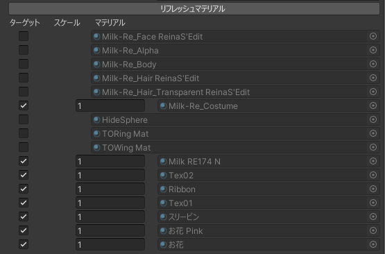
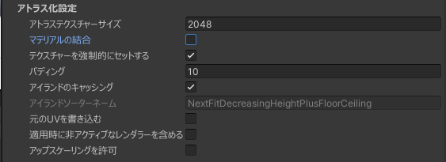

# AtlasTexture

## 概要

テクスチャの必要な部分のみを集めたテクスチャを作ることでVRAMの削減を実現する、  
アイランド再配置技術と矩形転写(または、UVtoUV の転写技術)を基礎とした [AAO](https://github.com/anatawa12/AvatarOptimizer) に触発されて作られたコンポーネント

## Atlas化される条件

### レンダラー

- 適用時にアクティブであること、ただし [適用時に非アクティブなレンダラーを含める](#適用時に非アクティブなレンダラーを含める)が有効な場合は非アクティブでも対象となる
- tag が EditorOnly ではないこと
- Rendarar の持つ Mesh が存在すること
- Rendarar の持つ Mesh の UV0 が存在すること
- Rendarar の持つマテリアルが一つ以上存在すること
- Rendarar の持つマテリアルに Null が含まれていないこと

### マテリアルが持つテクスチャー

[lilToon](https://lilxyzw.github.io/lilToon/) の場合

- MatCapなどの通常のUVを使用しないテクスチャーではないこと

それ以外のシェーダーの場合

- Property "_MainTex" のみ

## 設定項目

### ターゲットルート

アトラス化されるレンダラーの最大範囲の指定となり、ここに指定した GameObject の子として存在するレンダラーがアトラス化の対象となる可能性があります。

### マテリアルセレクター

左から、アトラス化の対象の選択  
選択されていたら、倍率でそのマテリアルの持つテクスチャーの大きさを調整できる値  
最後に選択するマテリアルの表示。

マテリアルがほとんど 「(clone)」 とついていたり、必要なマテリアルが表示されていない場合、「リフレッシュマテリアル」ボタンを使用すると治る場合があります。

### アトラス化設定

#### アトラステクスチャーサイズ

アトラス化した後のテクスチャのサイズで、横幅と縦幅に使われ、正方形になります。

#### マテリアルの結合

アトラス化を適用するときにマテリアルを強制的に結合する機能

有効な時に、追加の項目が表示されます。  

##### プロパティベイク設定

上記マテリアルの結合の時に、マテリアルのプロパティの一部をテクスチャに焼きこむ機能

- None : 何もしない
- Bake : そのプロパティのテクスチャが存在し、プロパティの値に違いがあった場合
- Bake All Property : プロパティの値に違いがあった場合すべて

基本的には推奨は Bake で、Bake All Property は大幅な VRAM の増加を招く可能性があるため取り扱い注意。

##### 結合時マテリアルの参照

結合時にマテリアルの設定を参照できる機能

何も設定されていない場合、アトラス化対象のマテリアルの不定などれか一つが使用されます。

#### テクスチャーを強制的にセットする

アトラス化したテクスチャーをマテリアルに割り当てるとき、すでにテクスチャーが存在する場合にのみ置き換えられるのが通常動作ですが、この機能は既に存在するテクスチャーがなかったとしても強制的に設定する機能

#### パディング

アトラス化するときに、[アイランド](/docs/Reference/Common/Island.md)同士の感覚を広げる設定

#### アイランドソーターネーム

アイランドを再配置し、並び替えるアルゴリズムの名前、編集不可。

#### 元のUVを書き込む

UV1 にアトラス化する前の UV に書き込む機能

#### 適用時に非アクティブなレンダラーを含める

アトラス化を適用するときに非アクティブ、レンダラーが付いているGameObjectが非アクティブな状態なレンダラーを含めるオプション

アニメーション等でデフォルトでオフなアクセサリーが存在する場合に使用することが推奨

#### アップスケーリングを許可

[アイランド](/docs/Reference/Common/Island.md)の再配置を行う際に、アイランドの拡大を行うことを許可するかどうかの設定

#### テクスチャー詳細設定

テクスチャの詳細な設定を行うための項目です。 [詳細](./TextureFineTuning.md)
