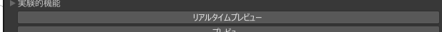

# RealTimePreview

[SimpleDecal](/docs/Reference/SimpleDecal)に限りリアルタイムでデカールのプレビューが複数同時に行える機能

## 使い方

リアルタイムプレビュー と書かれたボタンから使用できます。

リアルタイムプレビューに入ったデカールは、インスペクターを開いている間、更新され続けて位置や回転の変更や[ブレンドタイプキー](/docs/Reference/Common/BlendTypeKey.md)の変更がすぐに反映され、
この状態で、ほかのデカールのインスペクターを開き、同様のボタンを実行すると複数同時のプレビューも行うこともできます。

## デカールの順序

デカールの順序は基本的に、リアルタイムプレビューに入った順番です。

ただし、

- [ターゲットプロパティネーム](/docs/Reference/Common/TargetPropertyName.md)を変更する
- ターゲットレンダラーを変更する or ターゲットレンダラーの数を増やす(減らす)

のいずれかを行うと、そのデカールは一番最後の順番に移動します。
