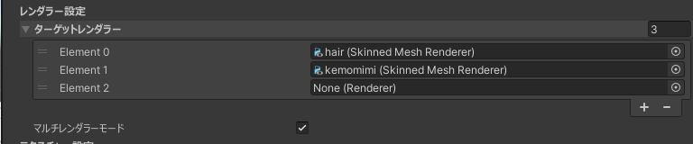
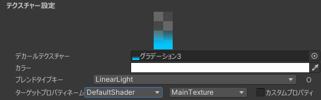
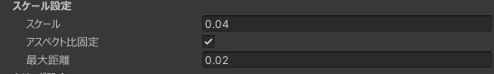
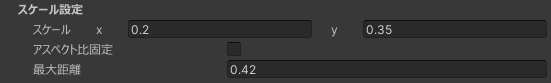
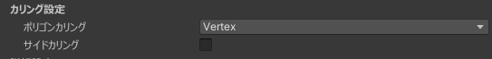
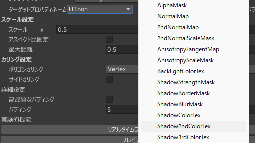

# SimpleDecal

## 概要

テクスチャを平行に投影したかのように見えるテクスチャを生成し、元のテクスチャと合成することでテクスチャ改変を行う  
[AtlasTexture](/docs/Reference/AtlasTexture)の為に作られた UVtoUV の技術を転用して作られたコンポーネント。

## デカールが張られる基準

- 適切なレンダラーが1つ以上指定されていること [詳細](#レンダラー設定)
- ギズモの範囲にポリゴンが存在すること [詳細](#カリング設定)
- 対象となるレンダラーが持つマテリアルに [ターゲットプロパティネーム](#ターゲットプロパティネーム)で指定されるテクスチャーが存在すること

## 設定項目

### レンダラー設定

対象とするレンダラー (SkinnedMeshRenderer or MeshRenderer) を入れる項目。

シングルレンダラーモード  
  
マルチレンダラーモード  
  

デカールを張りたい対象が複数のレンダラーにまたがっているときに使用します。

### テクスチャー設定

#### デカールテクスチャー

張り付けるテクスチャーそのもの。

#### カラー

デカールテクスチャーに乗算し、貼り付けるデカールの色をその場で変更する設定

ただし、デカールテクスチャーが存在しない場合は、カラーの色がそのままデカールテクスチャーになります。

#### ブレンドタイプキー

デカールを元のテクスチャと合成するときの色合成を指定できる設定。[詳細](/docs/Reference/Common/BlendTypeKey)

#### ターゲットプロパティネーム

デカールを張るテクスチャの選択。 [詳細](/docs/Reference/Common/TargetPropertyName.md)

### スケール設定

#### スケール

ローカルスケール の X (Y) の値で、デカールを張る 横幅(と縦幅)に対応しています。

#### アスペクト比固定

有効だと画像のアスペクト比に応じて 縦幅 の値を自動設定します。

アスペクト非固定無効化したUI  

#### 最大距離

ローカルスケールの Z の値で、デカールが張られる大体の奥行きと対応しています。

### カリング設定

#### ポリゴンカリング

処理を軽くするために行うポリゴンのカリング。

メッシュに対して非常に小さいデカールを使用したい場合にのみ、外してください。

#### サイドカリング

有効だとデカールする方向から見て裏面となるポリゴンにはデカールが張られなくなります。
:::info
スケールの一部がマイナスになっているとデカールする方向から見て表面に張られなくなることがあります。
:::

### 詳細設定

#### 高品質なパディング

通常パディングはとてもギザギザしたパディングになっていて、それをパディングを高品質で生成するオプションです。  
高負荷でアバターのビルド時間の増加を招くので必要がなければ使わないほうが良いです。

#### パディング

MipMapでにじまないようにするためのパディングの幅です。

### 実験的機能

:::warning
これらは実験的機能で予告なく削除や変更が行われる可能性があります。
:::

#### アイランド選択

[アイランドセレクター](/docs/Reference/IslandSelector)を用いて、デカールの描画範囲をアイランド単位でマスクすることができます。

#### 深度デカール

デカールを張る方向から一番手毎の部分にのみデカールが張られるようにできる機能

##### 深度反転

深度判定を反転し、"一番手前だけ"を"後ろ側になった場所すべて"にします。

## よくある Q & A

### 影色にデカールが適用されない & エミッションにもデカールを適用したい

デフォルト設定ではSimpleDecalは "_MainTex" にデカールを適用します。  
前者の場合lilToonであれば 影色1のテクスチャー "_ShadowColorTex" などが存在し、それらに "_MainTex" とは違うテクスチャーが入っているようなマテリアルで発生し、それにもデカールを適用することで解決できます。

具体的にはデカールを複製し、[ターゲットプロパティネーム](/docs/Reference/Common/TargetPropertyName.md)で該当するテクスチャーのプロパティを選択すること。

後者のエミッションの場合でも、エミッション用のプロパティを選択することで解決できますが、該当となるプロパティにテクスチャーが割り当てられていない場合適用されないのでご注意ください。
