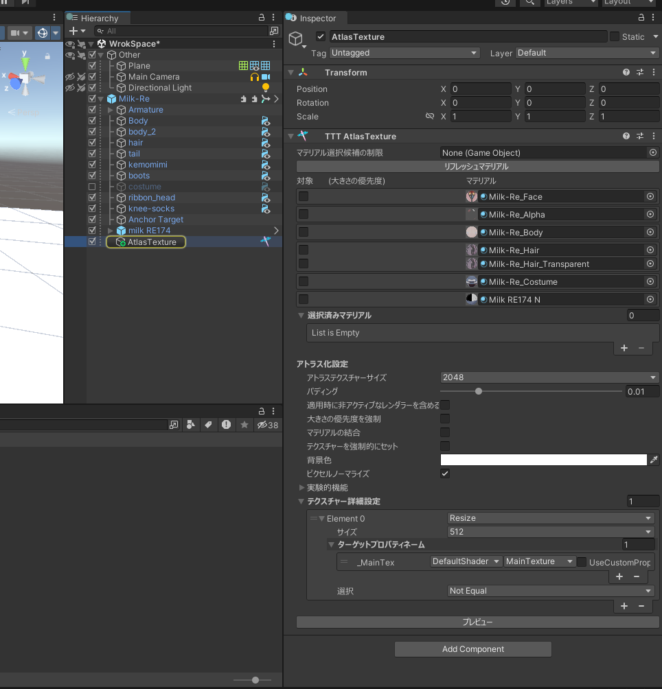
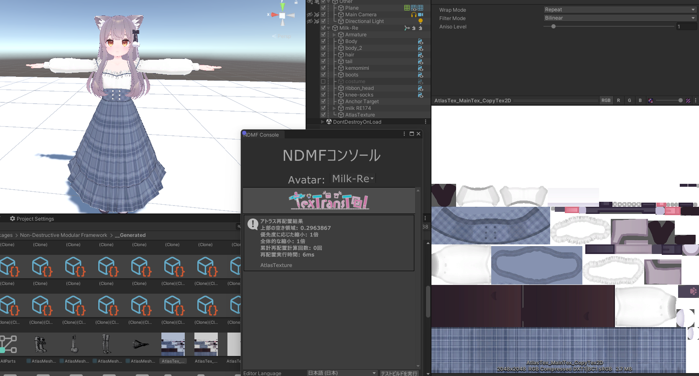
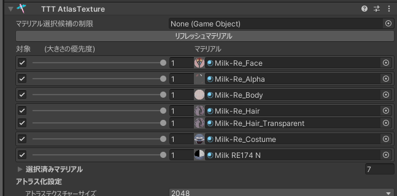

# AtlasTextureのチュートリアル

VRAMの使用量を削減したい！！

なら、Blenderに持って行ってUVを再配置して、それに合ったテクスチャをベイクを使って生成して、それらをUnityに再度インポートして...

なんてめんどくさいじゃん！！！

AtlasTextureを使えば、めんどくさいVRAM使用量削減作業を __非破壊で簡単__ にすることができます！

## チュートリアル

このチュートリアルでは別の衣装を使っているけど、
デフォルトの衣装が一部使われていて、デフォルト衣装のテクスチャに無駄が生じているケースでアトラス化を使ってみましょう！  

アバターのルートを右クリックしてから、TexTransTool/TTT AtlasTexture を選択！  

そしたらこのような状態になると思います！アバター内に GameObject AtlasTexture が生成され、アバターにあるマテリアルが一覧表示されます。  

もしそうでなければ、AtlasTexture がアバターの中にないか、 TexTransTool のバージョンが古い可能性があるのでご注意ください！

つぎは、テクスチャーの無駄が出ているデフォルト衣装と追加した衣装のテクスチャをアトラス化をしたいので  
`Milk-Re_Costume` と `Milk RE174 N` のチェックボックスを有効化します。  

設定できたら `Manual Bake Avatar` か UnityEditor を再生し、ビルドしてみましょう！

画像のように NDMFコンソールにエラーが無く アトラス再配置結果が表示されている場合正しく動作してるでしょう！

どのようにアトラス化されているかを確認したい場合は、適当な衣装のレンダラーからアトラス化された後のマテリアルをたどって確認すると、画像右のような状態になってることが確認できます！

しっかりとアトラス化されていますね！いい感じです✨

最後に、正しく画像のように動作していれば、アバターのアップロード時に自動適用されるようになります！

もし画像のように正しく動作しない場合 ( アトラス再配置結果が表示されない アトラス化されたマテリアルが存在しない など... )  
そのときは、[アップロード時の注意点](/docs/Tutorial/index.mdx#アップロードの時の注意点) と アトラス化の対象となるマテリアルが正しく選択されているか などをご確認ください！

## Quest対応のためのアトラス化とマテリアルの結合のチュートリアル

これは 無駄を削るというよりもQuest対応のための、見た目を維持できない軽量化になりますが、  
Quest対応をするときに必要になるマテリアル数の削減やVRAMの削減をするための方法です！

まず、上記のチュートリアルは完全に理解している前提で始めます。

Quest対応の時はできるだけ数を減らす必要があるので...すべてのマテリアルをアトラス化対象に入れましょう！  

つぎに

- アトラス化設定のマテリアルの結合にチェックを入れる
- プロパティベイク設定 を Bake に変更する
- Quest用のマテリアルを 結合時マテリアルの参照 に割り当てる
- テクスチャーを強制的にセットする にチェックを入れる

をすれば設定は完了です！  
  
ビルドしてみるとQuest用のマテリアルに置き換えられ、テクスチャとマテリアルも1つになっていることを確認できます！

最後に注意点！  AtlasTexture のマテリアルの結合は __マテリアルをまとめるだけ__ で、__マテリアルスロットの結合はできません__。  
メッシュをマージしながらマテリアルスロットも削減できる[Anatawa12/AvatarOptimizer](https://github.com/anatawa12/AvatarOptimizer)の[TraceAndOptimize](https://vpm.anatawa12.com/avatar-optimizer/ja/docs/reference/trace-and-optimize/)や[MergeSkinnedMesh](https://vpm.anatawa12.com/avatar-optimizer/ja/docs/reference/merge-skinned-mesh/)との併用を強く推奨します。

## クレジット

- あまとうさぎ/Milk Re : https://booth.pm/ja/items/2953391
- るるくショップ/RE174 : https://ruruku14.booth.pm/items/4053389
