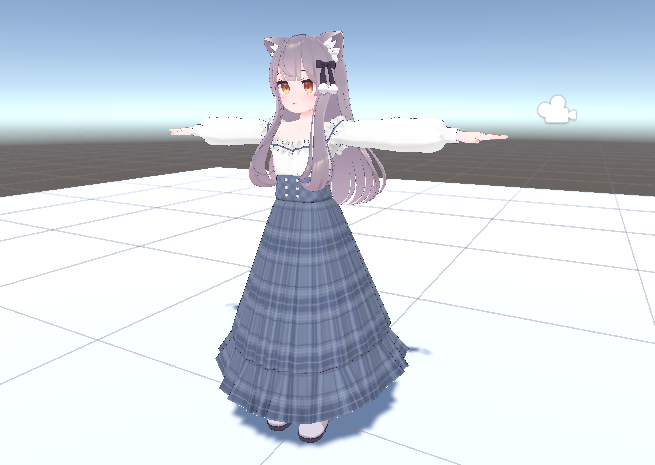
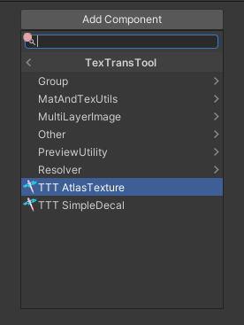
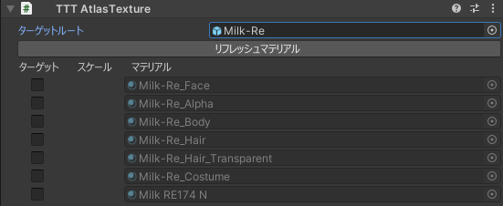
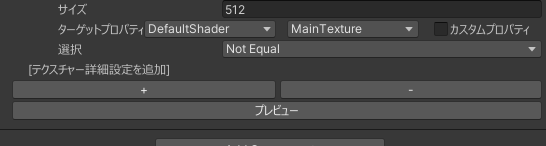
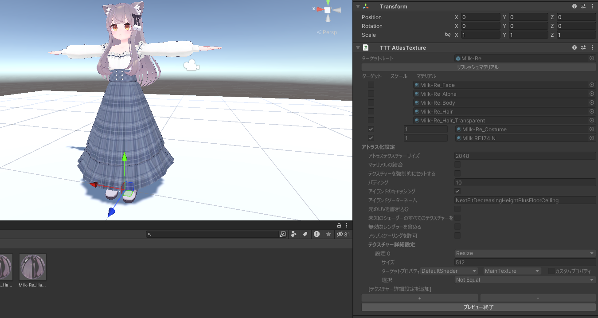
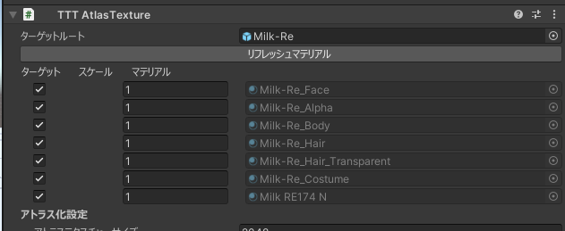
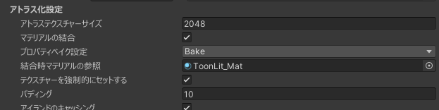

# AtlasTexture

AtlasTexture を使えばBlenderに持って行ってUVを再配置して、それに合ったテクスチャを生成して、それらをUnityに再度インポートして...などという超めんどくさいことをしなくても、テクスチャの無駄を切り詰めてVRAM削減を行うことができ、そのうえ非破壊で行うことができます！

## チュートリアル

このチュートリアルでは別の衣装を使っているけど、
デフォルトの衣装が一部使われていて、デフォルト衣装のテクスチャに無駄が生じているケースでアトラス化を使ってみましょう！  

新しく作るか、適当なゲームオブジェクトに AddComponent から TexTransTool/TTT AtlasTexture で追加することで使用することができます。  

まず最初に、アトラス化をしたいテクスチャを持ったレンダラー(メッシュ)の範囲を指定しましょう  

これに設定したオブジェクト配下にあるものすべてがアトラス化の対象の候補に入ります  
このケースの時はアバタールートを指定するのが手っ取り早いですね！設定したらマテリアル一覧が表示されます  

このチュートリアルでのケースの場合は、テクスチャーの無駄が出ているデフォルト衣装と追加した衣装のテクスチャをアトラス化をしたいので！  
Milk-Re_Costume と Milk RE174 N のチェックボックスを有効化します  

設定できたら プレビューしてみましょう！  

プレビューしたら...見た目には大きな変化がなく、エディターにエラーなどが出てなく、AtlasTextureの表示のほとんどが灰色になっていれば正常にできていると思われます。

...さすがにどんな感じにアトラス化されてるかみたいですよね！  
そんな時はアトラス化した衣装の適当なレンダラーのインスペクターからマテリアルを開きメインテクスチャーを見るとその結果を確認することができます  

しっかりとアトラス化されていますね！いい感じです！

最後に、アバターの配下にAtlasTextureを追加したゲームオブジェクトが入って入れれば、アバターアップロード時に自動でアトラス化が適応されるので、アバター配下に移動するのをお忘れなく。

## Quest対応のためのアトラス化とマテリアルの結合のチュートリアル

これは 無駄を削るというよりもクエスト対応のための、見た目を維持できない可能性がある最適化になりますが、
Quest対応をするときに必要になることがあるマテリアル数の削減やVRAMの削減をするための方法です！

まず前提として上記のチュートリアルは完全に理解している前提で始めます。

クエスト対応の時ケースで、できるだけ数を減らすなら...すべてのマテリアルとテクスチャをアトラス化対象に入れましょう！  

そしたら

- アトラス化設定のマテリアルの結合にチェックを入れる
- プロパティベイク設定をBakeに変更する
- そしてクエスト用のマテリアルを結合時マテリアルの参照に入れる
- テクスチャーを強制的にセットするにチェックを入れる

をすれば設定は終わりです！  

そしたら、プレビューしてみるとクエスト用のマテリアルに置き換えられ、テクスチャとマテリアルも一つになっていることを確認できます！

最後に、注意点なのですが、AtlasTextureのマテリアルの結合は"マテリアルをまとめるだけ"なので、"マテリアルスロット"を結合することはできないため、メッシュをマージしながらマテリアルスロットも削減できる[Anatawa12/AvatarOptimaizer](https://github.com/anatawa12/AvatarOptimizer)の[MergeSkinnedMesh](https://vpm.anatawa12.com/avatar-optimizer/ja/docs/reference/merge-skinned-mesh/)との併用を強く推奨します。

## クレジット

- あまとうさぎ/Milk Re : https://booth.pm/ja/items/2953391
- るるくショップ/RE174 : https://ruruku14.booth.pm/items/4053389