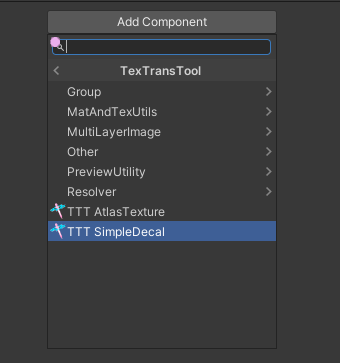
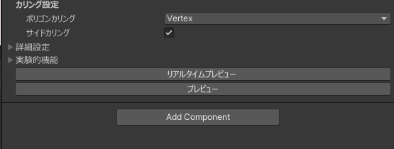
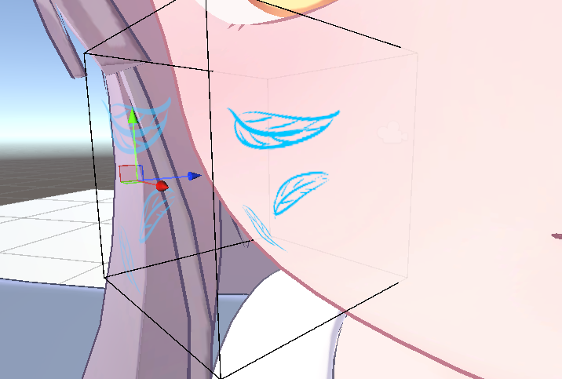

# SimpleDecal

SimpleDecal を使えばUVの理解をしなくても直感的にテクスチャに柄や模様、それに加えて髪の毛のメッシュなどを行うことができ
それらを、非破壊的に行うことができます！

## チュートリアル

はじめに、新規ゲームオブジェクトを生成し AddComponent から TexTransTool/TTT SimpleDecal で追加することで使用することができます。

そしたら、レンダラー設定のターゲットレンダラーにデカールを張りたいレンダラー(メッシュ)を、そしてデカールテクスチャーにそれらレンダラーに張り付けたい柄や模様のテクスチャーを設定

次に、デカールを張りたい場所や大きさ、角度を調整！

たとえば...ほっぺに模様を張るときだったらこんな感じ！

位置や大きさなどの調整ができたらプレビューボタンを押して確認しよう

望ましい位置にデカールが張られていたことが確認できたら、プレビューを終了しましょう！

最後に、アバターの配下にSimpleDecalを追加したゲームオブジェクトが入って入れれば、アバターアップロード時に自動でデカールが適応されるので、アバター配下に移動するのをお忘れなく。