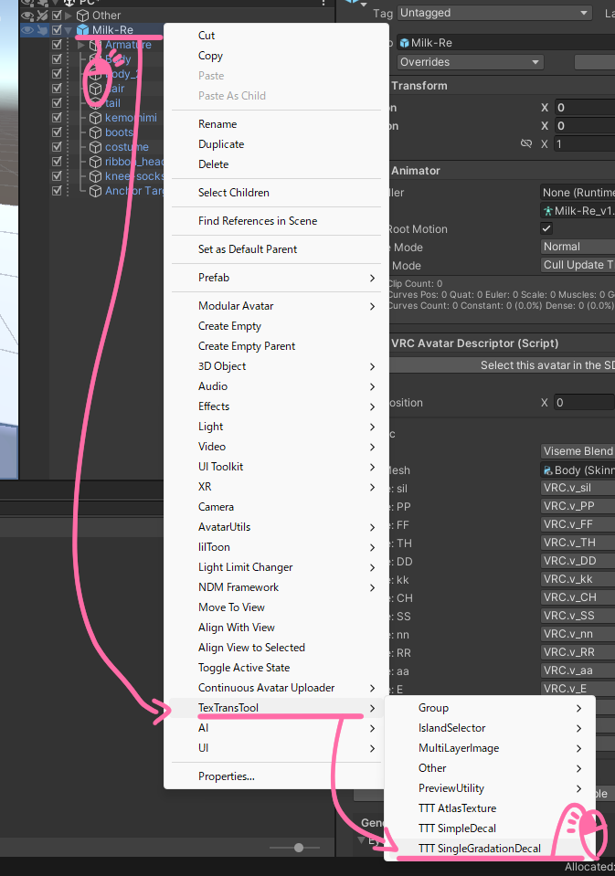
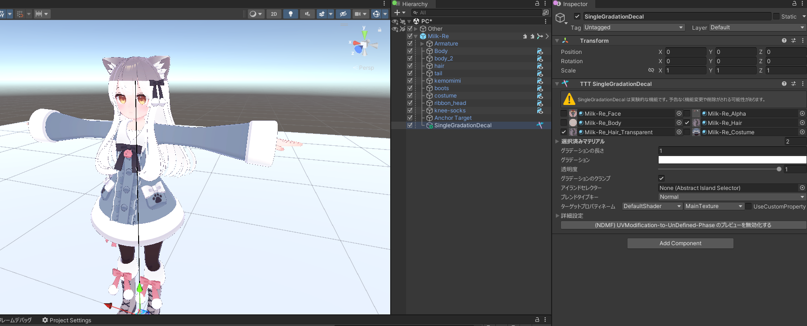
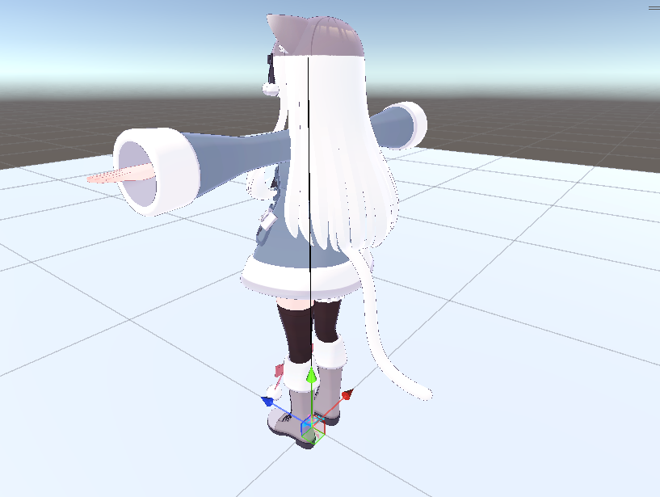
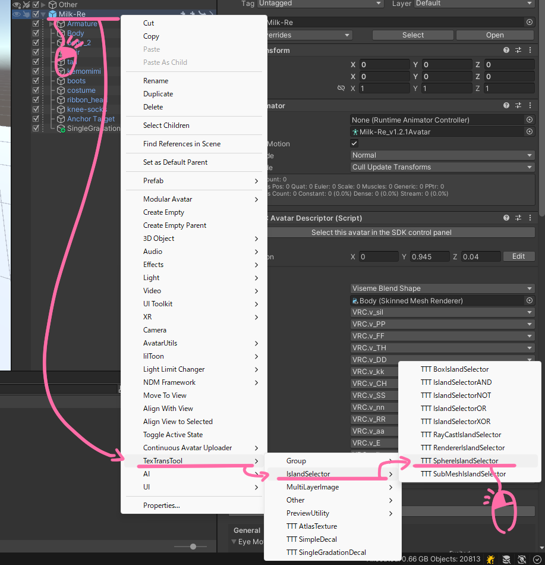
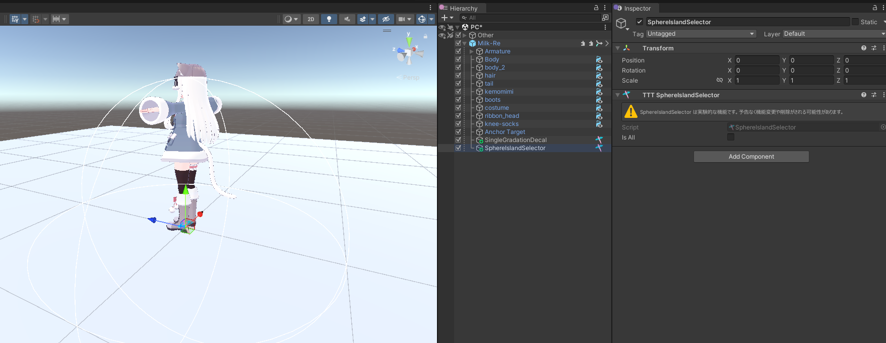
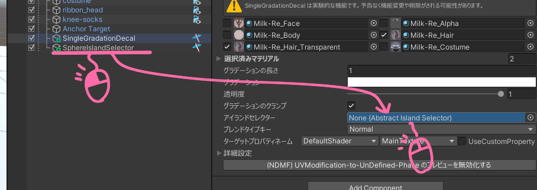
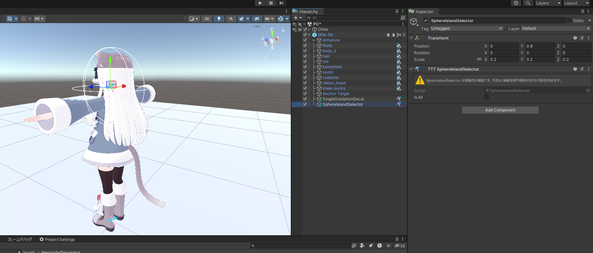
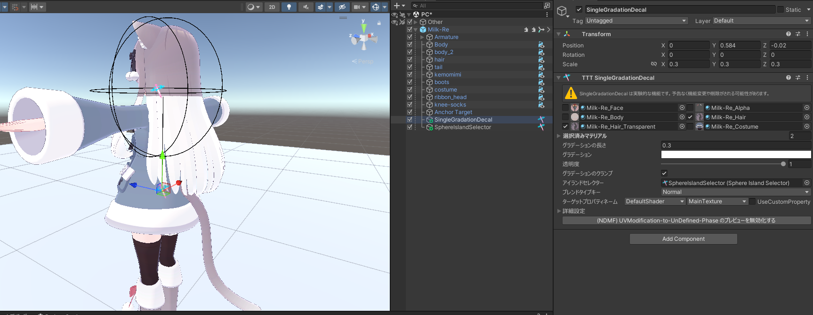
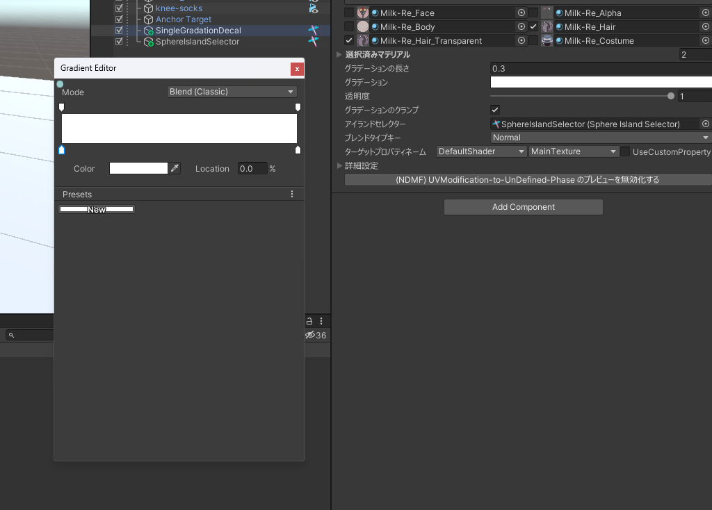
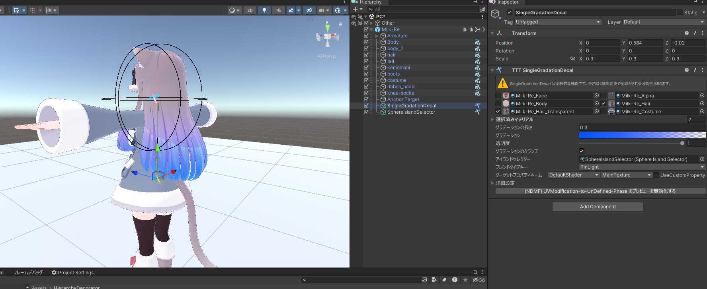

# SingleGradationDecal のチュートリアル

手っ取り早く髪の毛とかにグラデーションを入れたいときに！

[SimpleDecal](/docs/Reference/SimpleDecal) はグラデーション用の画像を用意しないといけなくてだるいじゃん...

そんなときのために！ 汎用性と引き換えに、グラデーションに特化した デカール(?) です！

## チュートリアル

:::warning
SingleGradationDecal は実験的なコンポーネントです！予告なく機能変更や削除がされる可能性があります。
:::

はじめに、アバターのルートを右クリックしてから、TexTransTool/TTT SingleGradationDecal を選択！  

そしたらこのようなインスペクターが表示されるので、グラデーションを入れたい場所のマテリアルを選択します。  

選択したらこのように真っ白になると思います！　　

後ろから見るとしっぽまで白くなっていますね...今回は髪の毛だけにしたいので アイランドセレクター を使用して髪の毛だけの範囲になるようにしましょう！  

[アイランドセレクター](/docs/Reference/IslandSelector) と言ってもいろいろなセレクターが存在するのですが...

今回は球体の範囲内に入ったアイランドを選択できる [SphereIslandSelector](/docs/Reference/IslandSelector#boxislandselector--sphereislandselector) を使用しましょう！  
アバターのルートを右クリックしてから、TexTransTool/TTT SphereIslandSelector を選択！  

生成できたらこのように表示されると思います。  

次に、生成したセレクターを登録しましょう！  

登録できたら、 SphereIslandSelector を適当に大きさ変えたり動かしたりして、髪の毛だけ白くなるようにしましょう！  

これでグラデーションが適用されうる範囲がいい感じになったので、グラデーション自体の調整をしましょう。

位置や回転を調整したり、 グラデーションの長さ を調整して、今回はこのようにしてみました！  

最後に、肝心の グラデーション を指定しましょう！ Unity 標準の UI で操作できます。
キーがそれぞれ、上が透明度、下が色を指定するような形でグラデーションを作成できます！

それと、合成モードとなる [ブレンドタイプキー](/docs/Reference/Common/BlendTypeKey) も同時に変更して良いでしょう！

今回はこのような感じにしてみました！入れたいグラデーションの色や合成、場所などは場合に応じて変わると思うので臨機応変使ってみてください！

## クレジット

- あまとうさぎ/Milk Re : https://booth.pm/ja/items/2953391
