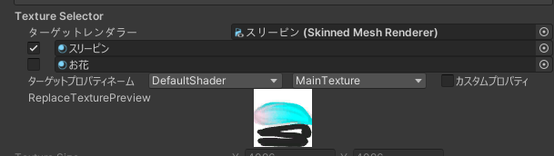

# TextureSelector

[MultiLayerImageCanvas](/docs/Reference/MultiLayerImageCanvas) や [TextureBlender](/docs/Reference/TextureBlender.md) で対象とするテクスチャーを指定するための物です。

## 設定項目

### セレクターモード

#### Absolute

テクスチャーに対する直接的な参照一つで指定するモード  
非常に簡単に使用でき D&D で使用するときには重宝しますが、ほかツールとの競合が発生する可能性が若干存在します。

#### Relative

テクスチャーに対してレンダラーとマテリアルスロットとプロパティネームを使用して、間接的に指定するモード  
簡易的ではないですが、ほかツールとの競合が起こりづらくビルドする前には存在しないテクスチャーを指定するような特殊なことも可能。
