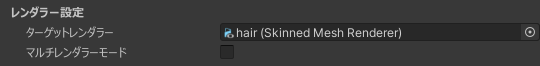
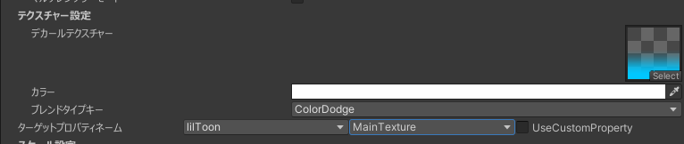
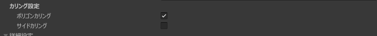
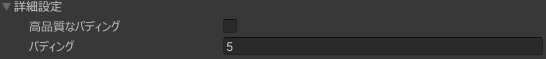

# SimpleDecal

## Overview

Texture modification is performed by generating a texture that looks as if it were projected parallel to the original texture and compositing it with the original texture.
The component is created by reusing the UV to UV technology created for [AtlasTexture](/docs/Reference/AtlasTexture)

## Standards for applying decals

- At least one appropriate renderer must be specified [Details](#renderer-settings)
- A polygon must exist within the range of the gizmo [Details](#texture-settings)
- The material of the target renderer must have the texture specified by [Target property name](#target-property-name)

## Setting items

### Renderer Settings

An item to enter the target renderer (SkindMeshRenderer or MeshRenderer).

Single renderer mode
  
Multi renderer mode
  

Use this when the object you want to apply a decal to spans multiple renderers.

### Texture Settings

#### Decal Texture

The texture itself that is applied.

#### Color

A setting that multiplies the decal texture and changes the color of the decal to be applied on the spot.

However, if the decal texture does not exist, the color will be used as is for the decal texture.

#### Blend Type Key

A setting that allows you to specify the color blend when blending the decal with the original texture. [Details](/docs/Reference/Common/BlendTypeKey)

#### Target Property Name

Select the texture to apply the decal to [Details](/docs/Reference/Common/TargetPropertyName)

### Scale Settings

#### Scale

The Local Scale X (Y) value corresponds to the width (and height) of the decal.

#### Fixed aspect ratio

When enabled, the Height value will be automatically set based on the image aspect ratio.

You can select a manual aspect ratio for the UI.  

#### Maximum Distance

The local scale Z value corresponds to the approximate depth at which the decal will be applied.

### Culling Settings

#### Polygon Culling

Polygon culling helps reducing processing cost.

Only turn this off if you want to use a very small decal for your mesh.

#### Side Culling

When enabled, decals will not be applied to polygons that are on the back side when viewed from the direction of the decal.
:::info
If any part of the scale is negative, the decal may not stick to the surface when viewed from the direction of application.
:::

### Advanced Settings

#### High quality padding

Normally, padding is very jagged, and this option generates padding with high quality.
It is expensive and increases the avatar build time, so it is better not to use it unless necessary.

#### Padding

The width of the padding to prevent bleeding with MipMap.

### Experimental Features

:::warning
These are experimental features and may be removed or changed without notice.
:::

#### Island Selection

You can use the [Island Selector](/docs/Reference/IslandSelector) to mask the decal drawing area on an island-by-island basis.

#### Depth Decal

A function that allows you to apply decals only to the first part from the direction of application of the decal

##### Depth Inversion

Inverts the depth judgment, changing "only the foreground" to "everywhere behind."

## Frequently Asked Questions (FAQ)

### Decals are not applied to shadow colors & I want to apply decals to emission as well

By default, SimpleDecal applies the decal to "_MainTex".
In the former case, if you use lilToon, there is a texture for shadow color 1, "_ShadowColorTex", etc, and this occurs with materials that contain a texture different from "_MainTex". You can solve this by applying a decal to that material as well.

Specifically, duplicate the decal and select the corresponding texture property in [Target Property Name](/docs/Reference/Common/TargetPropertyName).

In this last case regarding emission, you can also resolve the issue by manualy selecting a property for emission, but please note that this will not be applied if no texture is assigned to the relevant property.
