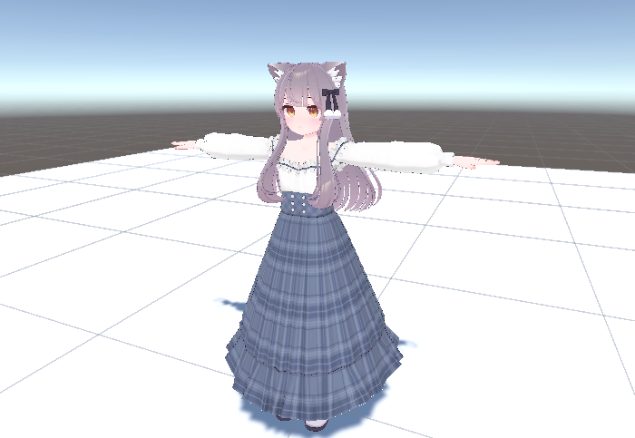
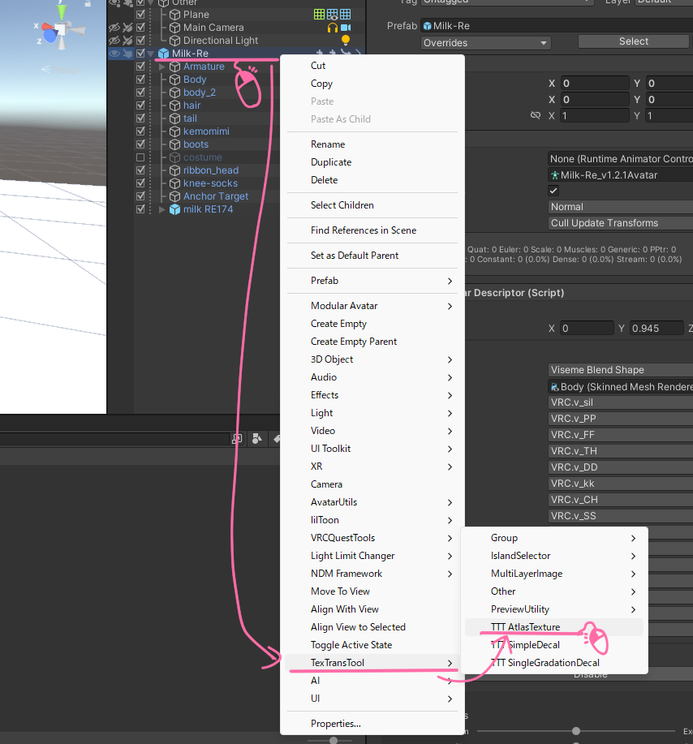
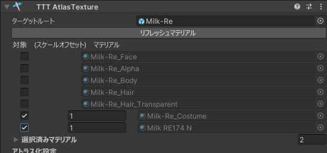
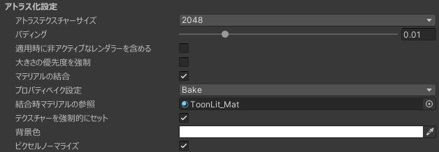

# AtlasTexture Tutorial

I want to reduce VRAM usage!!!

Then, take it to Blender, do UV re mapping , do bake at Texture matches UV , those take it again unity...

How tedious !!!

AtlasTexture makes the tedious task of reducing VRAM usage __non-destructive and easy!__

## Tutorial

This tutorial use a different costume and use default costume part.
This case the default costume has  wasted texture, trying atlasing!  

Right click to avatar root next left click to "TexTransTool/TTT AtlasTexture"!

Then it will look like the example image! GameObject AtlasTexture Generated within Avatar, and the materials avatar contained be list display.

If not, this may be because the AtlasTexture not within Avatar or have an older TexTransTool version.

next, I want atlasing the texture of default costume and added costume, which have wasted textures,  
so enable the check box of `Milk-Re_Costume` and `Milk RE174 N`.  

Once have setting, let's do build `Manual Bake Avatar` or UnityEditor play button!

Like the example image, no error in the NDMF console, If the Atlas Relocate Result displayed then it working properly!

If you want to see how it is atlasing, viewing texture in material from the renderer of any costume renderer, it should look like of right in example image!

It's well atlasing! It looks good✨

Last, if it works correctly like the example image, it will be auto applied when avatar upload!

If it does not work correctly like the example image ( Atlas Relocate Result not displayed, No atlased material exists, etc... )  
in that case, so check [Important notice for uploading](./index.mdx#important-notice-for-uploading) or is material to be atlased correctly selected and etc.

## Atlasing and material merging tutorial for Quest support

This is not an optimization but a load reduction for Quest support,  
a way to reduce Material count and VRAM usage, at the expense of visuals.

First, premise of fully understand the above tutorial.

Need to reduce count for Quest support ... make to include all material to atlas target.  

Next! setting these items and are done.

- Enable MaterialMerge from AtlasSettings
- Set PropertyBakeSetting to Bake
- Set MergeReferenceMaterial to Material for Quest
- Enable ForceSetTexture

  
If build, can check it material replaced for Quest and texture and material is one!

One final note! AtlasTexture MaterialMerge is __just merge the Material__, it can __not merge Material Slot__.  
I strongly recommended using it in combination with [TraceAndOptimize](https://vpm.anatawa12.com/avatar-optimizer/ja/docs/reference/trace-and-optimize/) or [MergeSkinnedMesh](https://vpm.anatawa12.com/avatar-optimizer/ja/docs/reference/merge-skinned-mesh/) in [Anatawa12/AvatarOptimizer](https://github.com/anatawa12/AvatarOptimizer) ,which merge Mesh and can merge MaterialSlot same time.

## Credit

- あまとうさぎ/Milk Re : https://booth.pm/ja/items/2953391
- るるくショップ/RE174 : https://ruruku14.booth.pm/items/4053389
