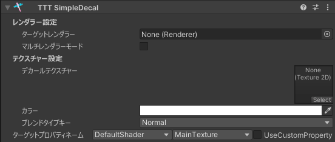
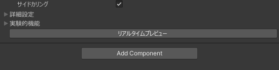
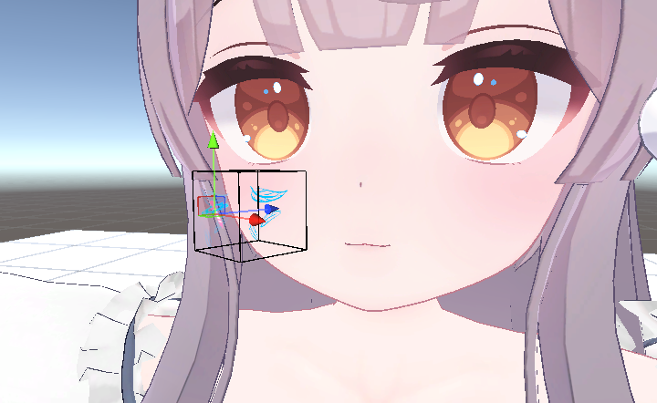
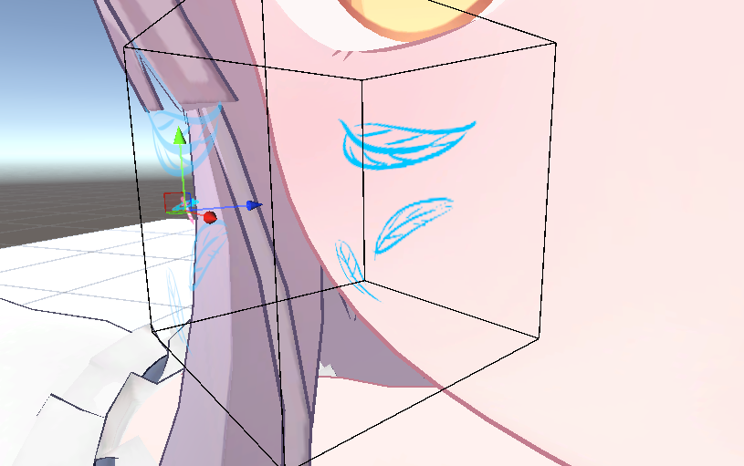
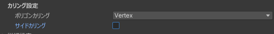
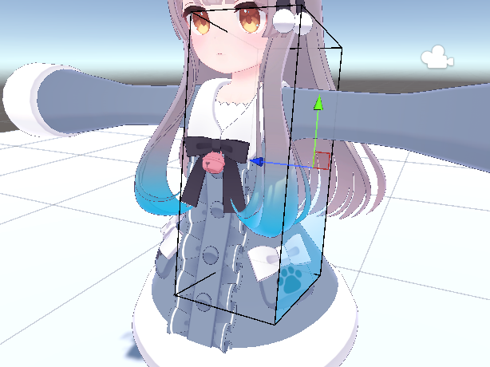
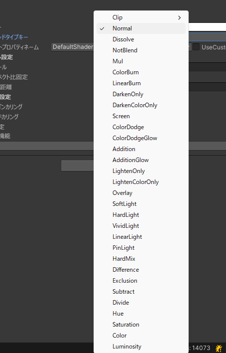
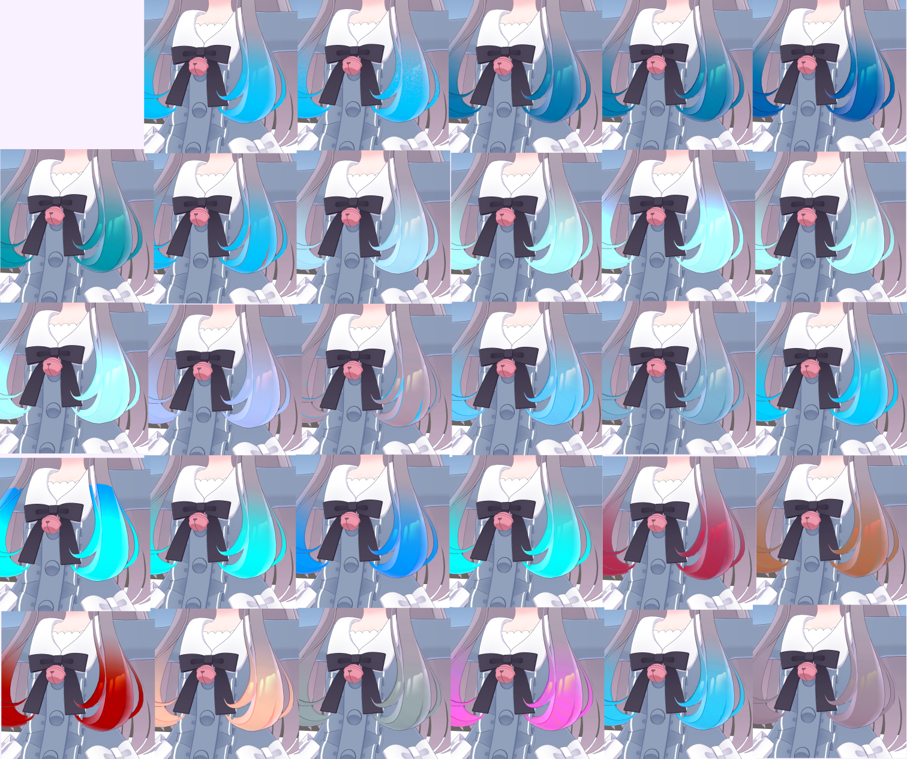
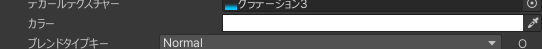

# SimpleDecal Tutorial

ちょっと色を変えるだけであっても、マテリアルで全部変えるか、外部ツールで頑張るかぐらい。  
前者は細かい調整ができないし、後者は UV 理解しなければいけない、

でも！ SimpleDecal を使えば UV を理解しなくても直感的に、  
テクスチャに柄や模様、それに加えて髪の毛のメッシュなどを追加することが、非破壊的で簡単にできます！

## チュートリアル

はじめに、新規ゲームオブジェクトを生成し AddComponent から TexTransTool/TTT SimpleDecal で追加することで使用することができます。

そしたら、レンダラー設定のターゲットレンダラーにデカールを張りたいレンダラー(メッシュ)を、  
そしてデカールテクスチャーにそれらレンダラーに張り付けたい柄や模様のテクスチャーを設定したら  

次は位置やサイズ調整ですが、調整しやすいようにするためにリアルタイムプレビューを有効化しましょう！

デカールを張りたい場所や、角度の調整を行い、 大きさや奥行きは下記画像のスケールと最大距離を操作して調整します。  

たとえば...ほっぺに模様を張るときだったらこんな感じ！

いい感じの場所にデカールが張られていたことが確認できたら、リアルタイムプレビューを終了しましょう！

最後に、アバターの配下にSimpleDecalを追加したゲームオブジェクトが入って入れれば、  
アバターアップロード時に自動でデカールが適応されるので、アバター配下に移動するのをお忘れなく。

## グラデーションを入れるチュートリアル

SimpleDecal はただデカールができる...ただ"テクスチャを直感的に張り付ける"だけのツールではないのでここでは特殊な使い方の一例である、  
髪の毛のグラデーションを入れる使い方のチュートリアルです！

前提として上記のチュートリアルは完全に理解していることを前提に始めます。

まず適当なグラデーション素材を用意し、それを SimplDecal に設定し、SimpleDecal の位置や大きさ、角度を Milk の前髪に入れる場合は、画像のように配置します。

次にグラデーションを範囲内のポリゴンすべてに反映するためにサイドカリング(裏面に張らなくする設定)を無効化します

設定が終わったらプレビューしてみましょう！

下からきれいなグラデーションが入っていることがわかりますが...もっと違った色の入れ方がしたいってことがあると思います。

そんな時は TexTransTool では ブレンドタイプキーを変えることで 約30個の標準的な色合成を使うことができます！

画像は左上から順に上の画像で列挙されている順の物でこのように入れることが可能です！

量が多いですが、すべてを覚える必要はないので適当にいじっていい感じになったものを使うのが良いでしょう。

今回はグラデーションの画像に青色の透過グラデーションを使用しましたが、白色の透過グラデーション画像を使用すれば、カラーの項目からその場で色を変えてグラデーションとして使用することができます  

合成モード(ブレンドタイプキー)と入れる色を調整すれば、いろいろな色のグラデーションを簡単に、そして非破壊で入れることができるでしょう！

## クレジット

- あまとうさぎ/Milk Re : https://booth.pm/ja/items/2953391
