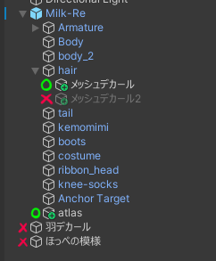

# Tutorial

## What is this tool?

TexTransTool is a tool that is [high level atlasing](/docs/Tutorial/AtlasTexture-Tutorial) and [intuitive color modification](/docs/Tutorial/SimpleDecal-Tutorial)!

## Install

Installation form [VRChat Creator Companion](https://vcc.docs.vrchat.com) or [ALCOM](https://vrc-get.anatawa12.com/alcom/) is recommended. [Add package link](vcc://vpm/addRepo?url=https%3A%2F%2Fvpm.rs64.net%2Fvpm.json)

For (the purpose of) avatar modification, TexTransTool depends on [NDMF](https://github.com/bdunderscore/ndmf). It is highly recommended to install them together.
If already install [ModularAvatar](https://modular-avatar.nadena.dev/ja/) or [AvatarOptimaizer](https://vpm.anatawa12.com/avatar-optimizer/ja/) no probrem.

## How to use

```mdx-code-block

import {TutorialCardElement} from '@site/src/components/TutorialCard';

<TutorialCardElement />

```

## Important notice for uploading

TexTransTool is __Non Destructive Texture Modification Tool__, and the components will be applied when upload, __Trying to upload avatar while [previewing](/docs/Reference/General/Preview) result in abortion__

next, applying condition when uploading is following:

- The components is children of Avatar (A GameObject with as AvatarDisctriptor and it subordinates)
- That it is Active
- Tag is not EditorOnly

If it is not all EditorOnly, it will look like this Image.  
  
please note that only item with green circles will be applied when uploading.

Finally, Plase note that if [NDMF](https://github.com/bdunderscore/ndmf) is not present project, not applying when avatar uploading.
